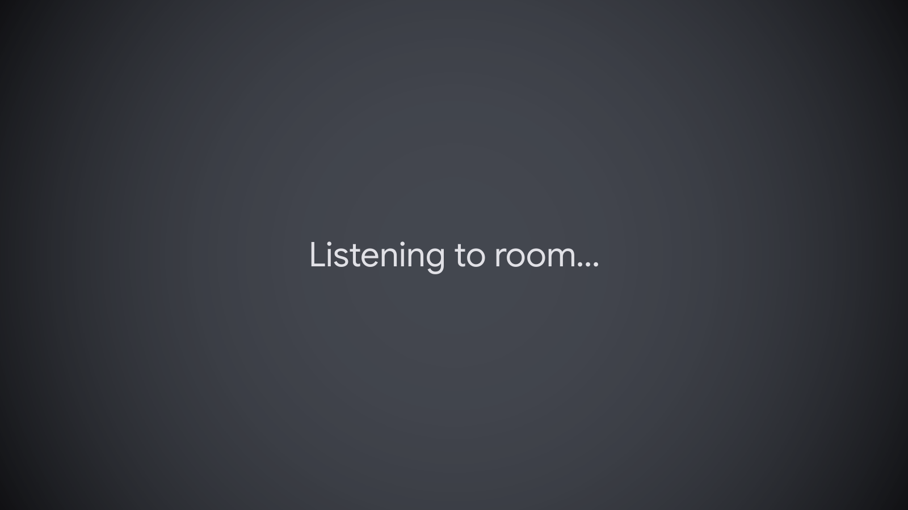
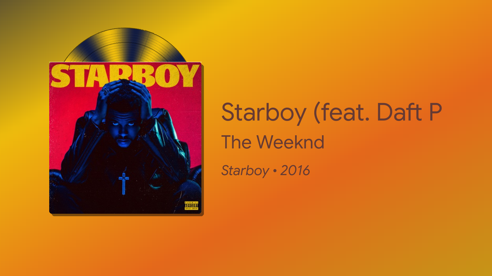
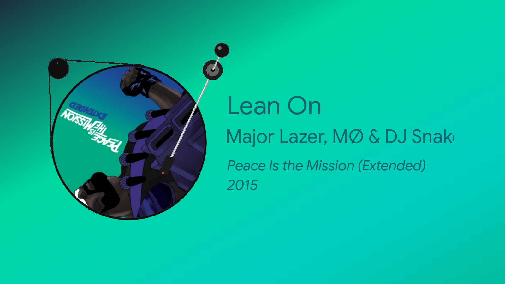
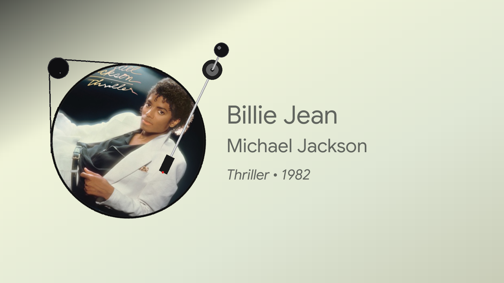
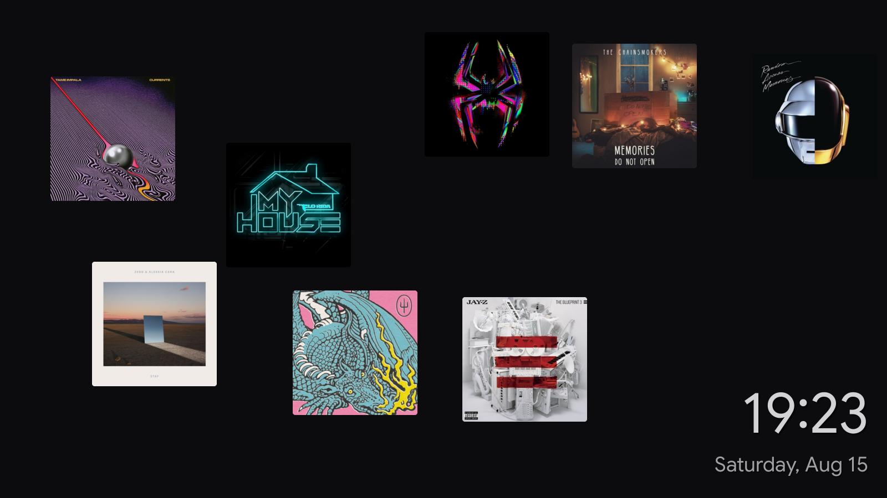
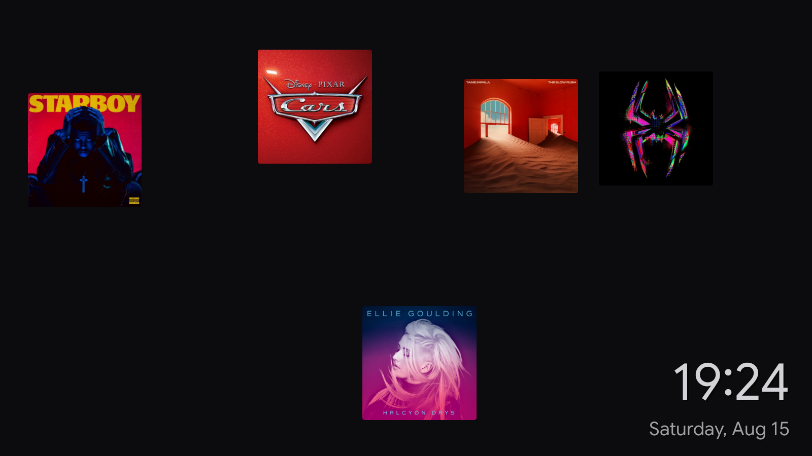

# Now Playing — Ambient Music Display for Raspberry Pi

An always-on Raspberry Pi display that listens to the room, figures out what song
is playing, and shows the album art. When nothing is playing it falls back to a
clock screensaver with a drifting collage of previously-seen album covers.

It runs headless as a `systemd` service and draws directly to the framebuffer via
Pygame + `kmsdrm`, so it needs no desktop environment.

## Screenshots

The display follows the life of a song, from detection to recognition to art.

When the room falls quiet, the app quietly samples audio and screens it locally
for music — no network, no cloud, until there's a reason to reach out.



Once music is confirmed, it queries for a match and bridges to the result.


**The default engine** presents the album art as a sleeve, with a record peeking
out from behind it, over a background tinted from the cover's own palette.




**The alternate engine** (`--display vinyl`) turns the art into a spinning
picture-disc record, complete with a belt-drive motor and tonearm.




When nothing is playing, it drifts into a clock screensaver — a slow collage of
album covers it has seen before.




## How it works

The app runs two things concurrently on an `asyncio` loop:

1. **Audio recognition (background).** A USB microphone is sampled with the native
   ALSA `arecord` process (no PyAudio). Each sample is first screened locally by a
   **YAMNet TensorFlow Lite** model to decide whether music is actually playing —
   this avoids hammering the network when the room is silent. Only when music is
   confirmed does the app send audio for cloud recognition via
   [**ShazamIO**](https://github.com/shazamio/ShazamIO) — a free, third-party
   asynchronous library built on a reverse-engineered Shazam API (this project does
   **not** use any official Shazam SDK or API). A two-pass check and a "double-dip"
   (reusing the confirmation sample for the first recognition query) reduce both
   false positives and latency.

2. **Display (foreground).** A Pygame engine renders at a target 60 FPS. It shows
   album art with synchronized scrolling title/artist text when a song is matched,
   a spinner during recognition/retries, and a clock + album-collage screensaver
   when idle. Music that stops is detected via a two-miss buffer before returning
   to the screensaver.

Recognized track metadata is written to `now_playing.json` on each attempt, which
doubles as a debug record of the last result.

### Project layout

The code is organized into packages by role: `audio/` (capture + recognition),
`display/` (rendering), and `common/` (shared utilities). The entry point stays
at the root.

| File | Role |
|------|------|
| `main.py` | Entry point. Wires the display + audio engines together and runs the async loop. Selects the display engine via the `--display` flag (`standard` / `vinyl`). |
| **`audio/`** | |
| `audio/audio_engine.py` | Mic capture (ALSA `arecord`), gain/DSP, ShazamIO cloud recognition with retries. |
| `audio/music_detector.py` | Local YAMNet TFLite inference — "is this music?" gate before hitting the network. |
| `audio/audio_utils.py` | ALSA error silencing, UTF-8 console, ShazamIO metadata parsing, JSON dumps. |
| **`display/`** | |
| `display/display_base.py` | `BaseNowPlayingDisplay` — the shared foundation for both engines: driver/font bring-up, the fade state machine, state transitions (clock/status/song), the animated background, text marquee, refresh spinner, and the top-level frame compositing. Concrete engines only implement the left-side artwork. |
| `display/album_sleeve.py` | Default engine (`AlbumSleeveDisplay`). Shows the album art as a flat sleeve with a spinning record peeking out behind it. |
| `display/spinning_vinyl.py` | Alternate engine (`SpinningVinylDisplay`). Turns the art into a large spinning picture-disc record with a belt-drive motor and tonearm. |
| `display/display_utils.py` | Image download/decode, surface signatures, color parsing, and drawing helpers shared by the engines. |
| `display/screensaver.py` | Clock + drifting album-cover collage shown when idle. |
| `display/text_scroller.py` | Synchronized marquee scroller — continuous news-ticker wrap-around, used by both engines. |
| **`common/`** | |
| `common/logger_utils.py` | Shared logging config with a custom `SUCCESS` level. |
| `common/paths.py` | Central definitions of project paths (resources, ml-model, album cache, JSON) resolved from the repo root. |

Both display engines subclass `BaseNowPlayingDisplay` and expose their own class,
which `main.py` aliases to a common name on import — so the two engines are fully
interchangeable while sharing nearly all their code. The only real difference
between them is how the artwork on the left of the screen is drawn.

### Directories

| Folder | Contents | In git? |
|--------|----------|---------|
| `ml-model/` | YAMNet model (`1.tflite`) + `yamnet_class_map.csv`. Required at runtime. | Yes |
| `resources/` | Fonts and static image assets. | Yes |
| `album_cache/` | Downloaded album art, cached at runtime. | No (regenerated) |
| `.venv/` | Local virtual environment. | No (machine-specific) |
| `__pycache__/` | Python bytecode. | No |

The YAMNet model in `ml-model/` is required for local music detection. If it is
missing at runtime, the app logs a warning and falls back to treating all audio as
music — it still runs, just less efficiently.

## Hardware

- Raspberry Pi 3B (or similar) running Raspberry Pi OS (Debian 13 "Trixie").
- A display connected via HDMI (rendered through `kmsdrm`, target 1280×720).
- A USB microphone (auto-detected from `arecord -l`; falls back to the `default`
  ALSA device).

## Setup

The virtual environment is intentionally **not** committed (it's tied to a specific
machine and Python build). Recreate it from `requirements.txt`:

```bash
# System packages Pygame/audio need on a fresh Trixie install
sudo apt update
sudo apt install -y python3-venv python3-pip \
    libsdl2-2.0-0 libsdl2-image-2.0-0 libsdl2-mixer-2.0-0 libsdl2-ttf-2.0-0 \
    alsa-utils

# Create and populate the environment
cd ~/now-playing
python3 -m venv .venv
source .venv/bin/activate
pip install -r requirements.txt
```

Give the running user access to the display and audio hardware (needed for
`kmsdrm` and the mic):

```bash
sudo usermod -a -G video,render,audio "$USER"
# log out / back in (or reboot) for group changes to take effect
```

Confirm the microphone is detected:

```bash
arecord -l
```

## Running

Manually, for testing:

```bash
cd ~/now-playing
source .venv/bin/activate
python main.py                  # default "standard" engine
python main.py --display vinyl  # spinning-vinyl engine
python main.py --help           # list options
```

The app draws directly to the framebuffer via `kmsdrm`, and only one process can
own the display at a time. When testing by hand, stop the service first
(`sudo systemctl stop nowplaying`), and quit the manual run with **ESC** (not
Ctrl+C) so Pygame releases the display cleanly before the service is restarted.

`run.sh` does the same thing and is what the service calls:

```bash
#!/bin/bash
cd /home/tadinada/now-playing
source .venv/bin/activate
exec python main.py
```

## Running as a service

The app is designed to run under `systemd` as `nowplaying.service`, drawing
directly to the framebuffer (no desktop needed).

Create `/etc/systemd/system/nowplaying.service`:

```ini
[Unit]
Description=Now Playing Pygame Display
After=network.target sound.target

[Service]
Type=simple
User=tadinada
WorkingDirectory=/home/tadinada/now-playing
ExecStart=/home/tadinada/now-playing/run.sh
Restart=always
RestartSec=5
Environment="SDL_VIDEODRIVER=kmsdrm"
Environment="LC_ALL=C.UTF-8"
Environment="LANG=C.UTF-8"
StandardOutput=journal
StandardError=journal

[Install]
WantedBy=multi-user.target
```

Enable and start it:

```bash
sudo systemctl daemon-reload
sudo systemctl enable nowplaying.service
sudo systemctl start nowplaying.service
```

## Viewing logs and status

The service name is `nowplaying` (one word — no hyphen, even though the folder is
`now-playing`).

```bash
# Live tail of the logs (Ctrl+C to stop watching; does NOT stop the service)
journalctl -u nowplaying -f

# Last 100 log lines
journalctl -u nowplaying -n 100

# Logs since the last boot
journalctl -u nowplaying -b

# Current status (running/failed, uptime, last few lines)
systemctl status nowplaying

# Restart after a code change
sudo systemctl restart nowplaying
```

## Configuration

- **Display engine:** choose at launch with `--display`:
  `python main.py` (or `--display standard`) uses `display/album_sleeve.py`;
  `python main.py --display vinyl` uses `display/spinning_vinyl.py`.
  To change the engine the **service** runs, either add the flag in `run.sh`
  (`exec python main.py --display vinyl`) or change `DEFAULT_DISPLAY` at the top
  of `main.py`. With no flag, the default is `standard`.
- **Mic gain:** `software_gain` in `NowPlayingRecognizer.__init__` (`audio/audio_engine.py`)
  digitally boosts input (e.g. `1.8` = 180%).
- **Mic debug dumps:** `self.debug_mic` in `audio/audio_engine.py` writes the last captured
  audio to `debug_mic.wav` when `True`.
- **Recognition tuning:** `record_seconds`, `max_retries`, and the ML confidence
  threshold (`top_score > 0.15` in `audio/music_detector.py`) control sensitivity and
  latency.

## Troubleshooting

- **`kmsdrm` fails to initialize / black screen:** ensure the user is in the `video` and `render` groups, and prefer the apt Pygame (`sudo apt install python3-pygame`) if the pip build lacks Pi hardware support.
- **No microphone found:** check `arecord -l`; the engine auto-selects a USB mic and falls back to `default`. Adjust `_auto_detect_alsa_mic` if your device isn't matched.
- **ShazamIO recognition errors like `Temporary failure in name resolution`:** the Pi has no network. Recognition needs internet; local ML detection does not.
- **Wi‑Fi/network access:** administer this Pi over SSH (`ssh <user>@<pi-ip>`) rather than relying on the attached display, since the app owns the framebuffer.

## Credits

This project stands on several open-source pieces:

- [**ShazamIO**](https://github.com/shazamio/ShazamIO) — the free, third-party
  asynchronous library used for cloud song recognition. It is built on a
  reverse-engineered Shazam API; this project is not affiliated with, endorsed by,
  or using any official Shazam product or API.
- **YAMNet** — Google's audio event classification model (TensorFlow Lite), used
  locally to gate recognition on whether music is actually playing.
- **Pygame** — the rendering layer, drawing to the framebuffer via `kmsdrm`.